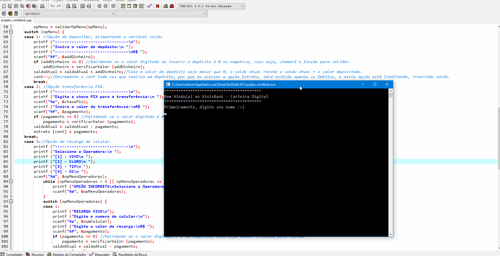

<h1 align="center">VinisBank - Carteira Digital </h1>

Projeto de estudo para praticar os conceitos aprendidos durante a disciplina de Algoritmos e Lógica de Programação da faculdade.

O sistema realiza as seguintes operações:
- Depósitos
- Extrato dos débitos em conta
- Realiza recargas de celular
- Transferências PIX

Se por acaso o usuário realizar débitos (recargas de celular e transferências Pix) e não tiver saldo, o mesmo ficará Negativo, informando ao usuário realizar um depósito o quanto antes para evitar ao máximo os acréscimos de juros diários.

<h2> Neste projeto pratiquei os seguintes conceitos de programação: </h2>

- Variáveis
- Estruturas de repetições
- Funções com retorno e passagem por valor
- Estruturas de condições

<h3> Projeto iniciado no dia 01/08/2022 e finalizado no dia 08/08/2022. </h3>

<h1 align="center">Gif do Resultado</h1>

<h2 align="center">Tecnologias Usadas</h2>

     
 
        
    

